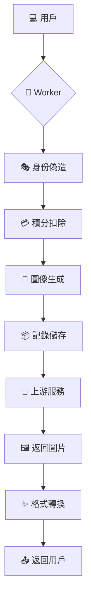

# 🎨 AI Generator Flux Ultimate (v2.6.0)

<div align="center">


**全功能 AI 繪畫 API 轉換器 · 支持多圖生成 + 風格預設 + 歷史記錄 + NSFW**

[](https://deploy.workers.cloudflare.com/?url=https://github.com/kinai9661/fluaipor)

</div>

---

## ✨ 新功能亮點 (v2.6.0)

<div align="center">

| 🖼️ 多圖生成 | 🎨 風格預設 | 📚 歷史記錄 | 🔞 NSFW 支持 |
|:---:|:---:|:---:|:---:|
| **1-4 張圖片**<br>一次生成多張 | **10 種風格**<br>預設模板 | **KV 存儲**<br>雲端保存 | **成人模型**<br>合法支持 |

</div>

### 🎆 核心特性

- **✨ 多張圖片生成**: 一次生成 1-4 張圖片，提升效率
- **🎨 風格預設系統**: 10 種內置藝術風格（寫實、動漫、賭博龐克等）
- **📚 完整歷史記錄**: Cloudflare KV 雲端存儲 + LocalStorage 本地備份
- **📊 統計分析**: 按模型、風格、日期分類統計
- **📥 數據導出**: 支持 JSON/CSV 格式導出
- **🔞 成人內容**: 支持 Flux Adult 模型（flux-kontext-por）
- **🗑️ 記錄管理**: 單筆刪除、批量導出

---

## 🚀 快速開始

### 方案一：一鍵部署（推薦）

1. **點擊部署按鈕** → 登入 Cloudflare 帳戶
2. **項目命名** → 例如 `my-flux-api`
3. **配置環境變數**:
   - `API_MASTER_KEY`: 你的訪問密鑰（必須）
4. **儲存部署** → 完成！🎉

### 方案二：手動部署

```bash
# 克隆倉庫
git clone https://github.com/kinai9661/fluaipor.git
cd fluaipor

# 安裝 Wrangler
npm install -g wrangler

# 登入 Cloudflare
wrangler login

# 部署
wrangler deploy
```

### 💾 KV 存儲配置（啟用歷史記錄）

1. **創建 KV Namespace**:
```bash
wrangler kv:namespace create "IMAGE_HISTORY"
```

2. **在 `wrangler.toml` 中配置**:
```toml
name = "fluaipor"
main = "worker.js"
compatibility_date = "2024-01-01"

[[kv_namespaces]]
binding = "IMAGE_HISTORY"
id = "YOUR_KV_NAMESPACE_ID"  # 從上一步獲取
```

3. **重新部署**:
```bash
wrangler deploy
```

---

## 🎮 使用指南

### 1. 🌐 Web 界面

訪問 Worker 地址體驗完整功能：

```
https://你的項目名.workers.dev
```

**功能面板**:
- 🖼️ **Gallery**: 圖片生成主面板
- 📚 **History**: 歷史記錄瀏覽
- 📊 **Stats**: 統計數據分析

### 2. 🤖 API 端點

#### 聊天接口（支持多圖）
```bash
curl -X POST https://your-worker.workers.dev/v1/chat/completions \
  -H "Authorization: Bearer YOUR_KEY" \
  -H "Content-Type: application/json" \
  -d '{
    "model": "flux-1.1-pro",
    "messages": [{"role": "user", "content": "a cyberpunk city"}],
    "n": 3,
    "style": "cyberpunk"
  }'
```

#### 圖片生成接口
```bash
curl -X POST https://your-worker.workers.dev/v1/images/generations \
  -H "Authorization: Bearer YOUR_KEY" \
  -H "Content-Type: application/json" \
  -d '{
    "prompt": "a beautiful sunset",
    "model": "flux-schnell",
    "n": 2,
    "size": "16:9",
    "style": "realistic"
  }'
```

#### 歷史記錄 API
```bash
# 獲取歷史
GET /v1/history?limit=50

# 導出記錄
GET /v1/history/export?format=json
GET /v1/history/export?format=csv

# 刪除記錄
POST /v1/history/delete
{"id": "record-id"}

# 統計數據
GET /v1/history/stats
```

#### 風格列表
```bash
GET /v1/styles
```

---

## 🎨 風格預設

| 風格 ID | 名稱 | 描述 |
|---------|------|------|
| `realistic` | 寫實風 | 高清照片質感，8K 解析度 |
| `anime` | 動漫風 | 日本動漫藝術風格 |
| `cyberpunk` | 跭博龐克 | 未來城市、霸虹燈 |
| `oil-painting` | 油畫風 | 古典藝術質感 |
| `watercolor` | 水彩風 | 柔和色彩、藝術感 |
| `3d-render` | 3D 渲染 | Unreal Engine 高品質 CGI |
| `sketch` | 素描風 | 銉筆手繪風格 |
| `fantasy` | 奇幻風 | 魔幻史詩風格 |
| `minimalist` | 極簡風 | 現代簡約設計 |
| `nsfw` | 成人風 🔞 | 藝術裸體、成熟主題 |

---

## 📊 模型對比

| 模型 | 速度 | 品質 | 費用 | 特點 |
|------|------|------|------|------|
| `flux-schnell` | ⚡️ 快 | ⭐️⭐️⭐️ | 1 學分 | 適合快速生成 |
| `flux-1.1-pro` | 🐢 中 | ⭐️⭐️⭐️⭐️⭐️ | 2 學分 | 專業級品質 |
| `flux-kontext-por` | ⚡️ 快 | ⭐️⭐️⭐️⭐️ | 1 學分 | 成人內容 🔞 |

---

## 🔧 配置參數

### 環境變數

| 變數名 | 必須 | 預設值 | 說明 |
|----------|------|---------|------|
| `API_MASTER_KEY` | 是 | - | API 訪問密鑰 |
| `IMAGE_HISTORY` (KV) | 否 | - | 歷史記錄存儲 |

### 請求參數

| 參數 | 類型 | 範圍 | 說明 |
|------|------|------|------|
| `n` | 數字 | 1-4 | 生成圖片數量 |
| `style` | 字串 | - | 風格預設 ID |
| `model` | 字串 | - | 模型選擇 |
| `size` | 字串 | 1:1, 16:9, 9:16 | 圖片比例 |

---

## ⚠️ 重要提醒

### 成人內容使用聲明

本項目支持成人內容模型（`flux-kontext-por`），**但請務必遵守以下規定**：

1. ✅ **合法使用**: 僅在法律允許的地區使用
2. ✅ **年齡限制**: 使用者必須年滿 18 歲
3. ❌ **禁止用途**: 不得用於非法、不道德的目的
4. ⚠️ **責任聲明**: 開發者不對濱用行為負責

### 技術風險

- 本項目涉及請求偽造技術，可能違反目標服務的使用條款
- 仅供學習研究使用，不建議用於生產環境
- 使用前請充分了解相關法律風險

---

## 📚 技術架構

### 系統流程



### 核心模塊

- **HistoryManager**: 歷史記錄管理
- **Logger**: 日誌系統
- **performUpstreamGeneration**: 生成邏輯
- **streamResponse**: 流式輸出

---

## 🔧 故障排除

### 常見問題

| 問題 | 解決方案 |
|------|----------|
| 🚫 401 認證失敗 | 檢查 `API_MASTER_KEY` 環境變數 |
| 🐢 響應超時 | 等待上游服務恢復 |
| 💸 積分不足 | 等待額度重置 |
| 💾 KV 不可用 | 自動降級到 LocalStorage |

---

## 🔜 更新日誌

### v2.6.0 (2025-11-28)
- ✨ 新增多張圖片生成功能
- 🎨 新增 10 種風格預設
- 📚 新增完整歷史記錄系統
- 🔞 支持成人內容模型
- 📊 新增統計分析面板
- 📥 支持 JSON/CSV 導出

### v2.4.0 (2025-11-26)
- 精簡化為純文生圖
- 鎖定 Flux Schnell 模型
- 增強 Web UI 日誌

---

## 👥 貢獻

歡迎提交 Issue 和 Pull Request！

---

## 📜 許可證

Apache License 2.0

---

<div align="center">

## 🎉 開始使用

**讓 AI 賦能你的創意**

[](https://deploy.workers.cloudflare.com/?url=https://github.com/kinai9661/fluaipor)

*✨ 星辰大海，代碼為舟，創意作帆 🚀*

</div>